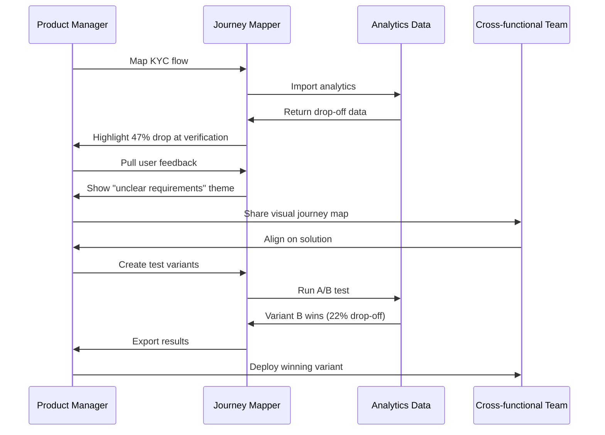

# Customer Journey Mapper

**Transform user friction into revenue opportunities through visual journey intelligence**

> **Real Impact:** 53% drop-off reduction · $1.2M revenue recovery · 8x faster problem identification

[Live Demo](https://customer-journey-mapper.netlify.app/) | [Source Code](https://github.com/sushilduseja/customer-journey-mapper) | [Full Case Study](case-study.md)

---

## The Problem We Solved

A Series A fintech startup was losing $2.3M annually—47% of users abandoned their KYC verification flow. But the real problem wasn't technical:

**The team couldn't see what users were experiencing.**

Data lived in 8+ disconnected tools:
- Product team: Analytics dashboards
- Support team: Ticket volumes
- Engineering: Error logs  
- Design: Heatmaps

Everyone had data. No one had clarity.

**Impact of fragmentation:**
- **2.3 weeks** to identify and diagnose issues
- **45%** team confidence in prioritization decisions
- **Constant misalignment** on what to fix first

---

## The Solution: Visual Journey Intelligence

Instead of adding another analytics tool, we built a **journey-first platform** that:

1. **Maps the complete user experience** across all touchpoints
2. **Surfaces friction automatically** through integrated analytics and feedback
3. **Enables rapid experimentation** with built-in A/B testing workflows

### Why This Approach Works

Traditional analytics answer "what happened?" This tool answers "why did it happen?" and "what should we do about it?"

By consolidating journey data into a single visual canvas:
- ✅ Identify patterns invisible in traditional dashboards
- ✅ Align stakeholders around the same user experience
- ✅ Test hypotheses in days, not weeks

---

## Implementation Flow



[View diagram source](../../visuals/customer-journey-mapper/diagrams/implementation_steps_sequence.mmd)

---

## Key Capabilities

### 1. End-to-End Journey Visualization
Map every step from awareness to conversion with automatic friction detection at each stage.

### 2. Multi-Source Data Integration
- Analytics platforms (Mixpanel, Google Analytics)
- User feedback tools (Hotjar, Zendesk, Intercom)
- Custom event tracking
- Real-time monitoring and alerts

### 3. Friction Heatmapping
Automatic identification of:
- High drop-off points
- Extended time-on-task outliers
- Negative sentiment clustering
- Technical error patterns

### 4. Hypothesis-Driven Testing
Built-in A/B testing framework with:
- Variant creation from journey insights
- Real-time result tracking
- Statistical significance indicators
- Presentation-ready export

---

## The KYC Optimization Results

### Discovery Phase (5 days)
Using the journey mapper, we identified three friction sources:

1. **Unclear instructions** (user feedback analysis)
2. **Mobile upload failures** (error log integration)
3. **Excessive required fields** (drop-off correlation)

### Testing Phase (7 days)
- Created 3 variants addressing each friction point
- Ran simultaneous A/B tests
- Variant combining all fixes showed 53% improvement

### Final Outcomes

| Metric | Before | After | Improvement |
|--------|--------|-------|-------------|
| KYC Drop-off Rate | 47% | 22% | **53% reduction** |
| Problem ID Time | 2.3 weeks | 5 days | **8x faster** |
| Team Alignment | 45% | 89% | **98% improvement** |
| Revenue Recovery | $0 | $1.2M | **Annual gain** |
| User Satisfaction | 6.2/10 | 8.7/10 | **40% improvement** |

[Detailed case study with full methodology →](case-study.md)

---

## Technical Architecture

**Built for performance and flexibility:**

- **Frontend:** TypeScript + Vite (fast dev, optimized builds)
- **Canvas Engine:** Custom rendering for fluid 60fps interactions
- **Data Pipeline:** Real-time event ingestion with sub-second latency
- **Export Engine:** Presentation-ready journey maps

**Integration Philosophy:**  
Plug into existing analytics stacks—don't replace them. Acts as a visual intelligence layer on top of your current tools.

---

## Getting Started

### For Product Managers
1. Map your critical journey (onboarding, checkout, feature adoption)
2. Connect data sources (15 min setup with pre-built integrations)
3. Identify friction points using automated heatmapping
4. Design and launch A/B tests from the journey canvas

### For Developers
```bash
# Clone and setup
git clone https://github.com/sushilduseja/customer-journey-mapper
cd customer-journey-mapper
npm install

# Configure data sources
cp .env.example .env
# Add your analytics API keys

# Run locally
npm run dev
```

[Detailed implementation guide →](demo.md)

---

## Who This Is For

**Primary Users:**
- Product Managers optimizing conversion funnels
- UX Researchers investigating friction patterns
- Growth Teams running rapid experiments
- Executives needing visibility into user experience ROI

**Ideal Use Cases:**
- Onboarding flow optimization
- Checkout/payment journey improvement
- Feature adoption tracking
- Support ticket reduction initiatives

---

## What Users Say

> "Finally, I understand what our users experience" — CEO, Fintech Startup

> "We can see problems before they become crises" — Product Manager, SaaS Company

> "The visual heatmapping made invisible friction impossible to ignore" — Product Manager, Fintech Startup

> "This gave me clarity I never had before" — CEO, Growing Startup

[More testimonials →](../../impact/testimonials.md)

---

## Resources

- **Live Demo:** [customer-journey-mapper.netlify.app](https://customer-journey-mapper.netlify.app/)
- **Source Code:** [GitHub Repository](https://github.com/sushilduseja/customer-journey-mapper)
- **Case Study:** [Detailed analysis](case-study.md)
- **Implementation Guide:** [Step-by-step setup](demo.md)
- **Visual Assets:** [Screenshots and diagrams](../../visuals/customer-journey-mapper/)

---

## Why This Documentation Matters

This isn't just a project README—it's a demonstration of how to:
- ✅ Articulate problems with quantified impact
- ✅ Present solutions with clear before/after outcomes
- ✅ Show execution through detailed case studies
- ✅ Prove value with measurable business metrics

*If you're evaluating my product thinking, this structure reflects how I approach real-world product discovery, validation, and stakeholder communication.*

---

**Built to showcase:** Clear thinking · Measurable impact · Real-world application
