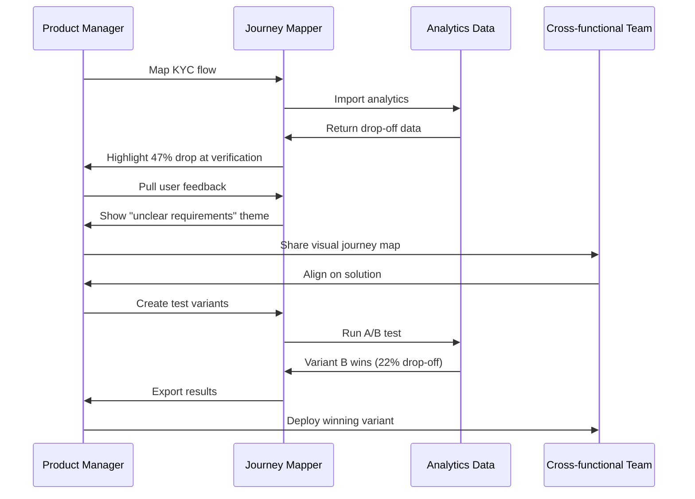

```mermaid
sequenceDiagram
    participant PM as Product Manager
    participant CJM as Journey Mapper
    participant Data as Analytics Data
    participant Team as Cross-functional Team
    
    PM->>CJM: Map KYC flow
    CJM->>Data: Import analytics
    Data->>CJM: Return drop-off data
    CJM->>PM: Highlight 47% drop at verification
    PM->>CJM: Pull user feedback
    CJM->>PM: Show "unclear requirements" theme
    PM->>Team: Share visual journey map
    Team->>PM: Align on solution
    PM->>CJM: Create test variants
    CJM->>Data: Run A/B test
    Data->>CJM: Variant B wins (22% drop-off)
    CJM->>PM: Export results
    PM->>Team: Deploy winning variant
```