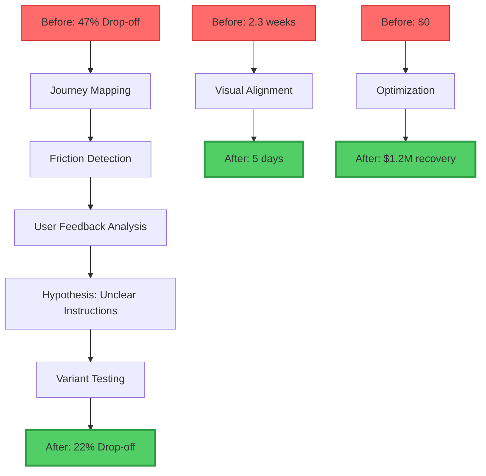

```mermaid
graph TD
    A[Before: 47% Drop-off] --> B[Journey Mapping]
    B --> C[Friction Detection]
    C --> D[User Feedback Analysis]
    D --> E[Hypothesis: Unclear Instructions]
    E --> F[Variant Testing]
    F --> G[After: 22% Drop-off]
    
    H[Before: 2.3 weeks] --> I[Visual Alignment]
    I --> J[After: 5 days]
    
    K[Before: $0] --> L[Optimization]
    L --> M[After: $1.2M recovery]
    
    style A fill:#ff6b6b,stroke:#c92a2a
    style G fill:#51cf66,stroke:#2f9e44,stroke-width:3px
    style H fill:#ff6b6b,stroke:#c92a2a
    style J fill:#51cf66,stroke:#2f9e44,stroke-width:3px
    style K fill:#ff6b6b,stroke:#c92a2a
    style M fill:#51cf66,stroke:#2f9e44,stroke-width:3px
```